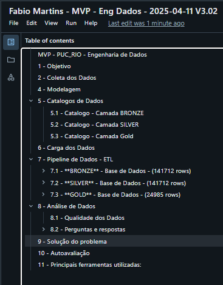

# MVP - PUC_RIO - Engenharia de Dados

## Curso Ciência de Dados e Analytics - Abril/2025

Aluno: Fabio Nunes Martins.

Professor: Victor Almeida.

Professor: Jose Boaro

Este MVP tem por objetivo  disponibilizar uma análise de dados para apoiar as decisões gerenciais fr uma empresa que presta serviço de Suporte. Este estudo foca na análise da  performance de equipee de suporte espalhadas em diversos escritórios de diferentes países. Essas equipes tratam Tickets de Incidentes com Prioridades (Low, Moderate, High e Critical ). Para cada tipo de Prioridade existe um SLA ( Service Level Agreement), que limita o tempo máximo para a resolução de cada ticket de Incidente criado.

Este estudo ajudará nas futuras renovações de  contratos e na readequação das equipes.

<a href="https://databricks-prod-cloudfront.cloud.databricks.com/public/4027ec902e239c93eaaa8714f173bcfc/1040150379560922/1404765122016821/1506217728357347/latest.html">Databricks Notebook</a>

        
<a href="Fabio Martins - MVP - Eng Dados - 2025-04-10 V2.4.ipynb">IPython Notebook</a>

